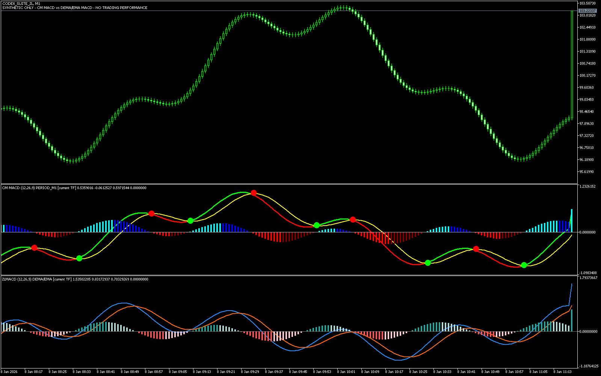
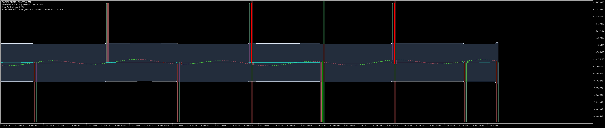
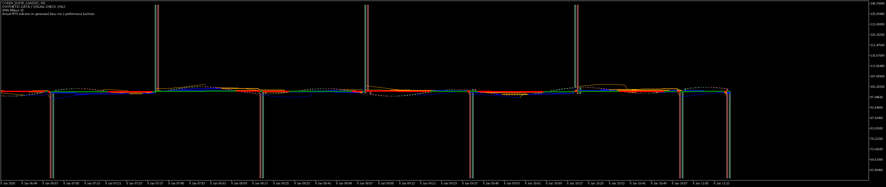
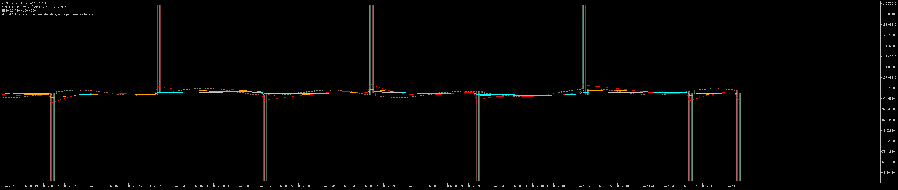
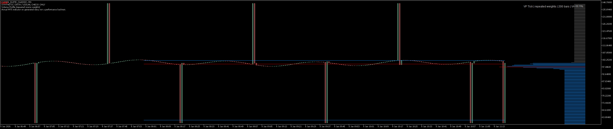
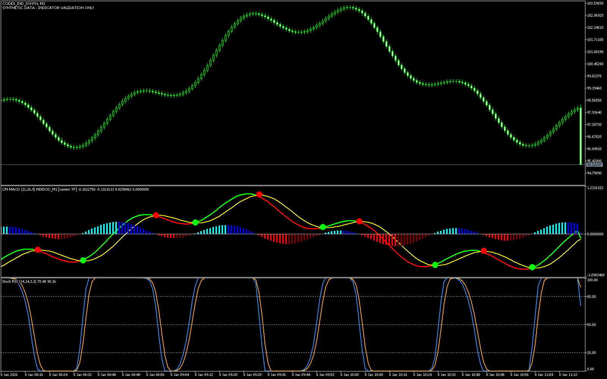
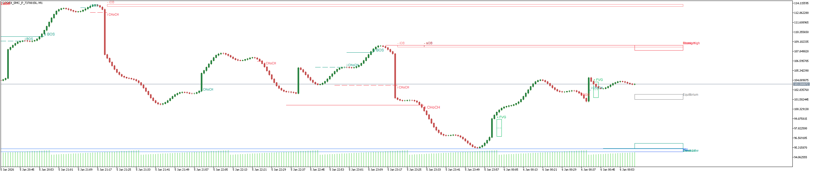
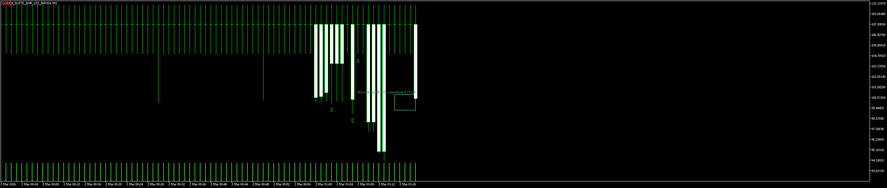
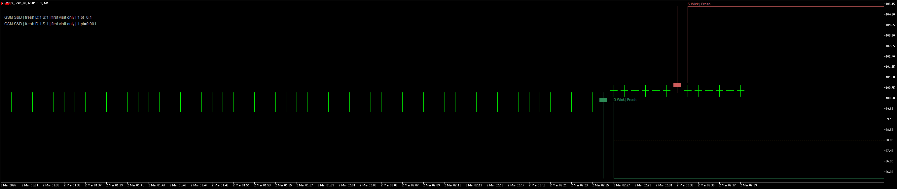

# MT5 实际图表预览

这些截图来自桌面 MT5 实际加载本包指标，使用专门构造的合成行情。它们用于检查绘图和状态，不是实盘走势，也不是盈利示例。数值验证结果另见 [验证结果](验证结果.md)。

## 两种 MACD

上方副图是 CM，下方是 ZeroLag。默认平滑方式不同，所以形状及交叉位置会不同；详见 [MACD 比较](MACD_比较说明.md)。

## 布林带 + RSI

夹具刻意放入跳动、平窗和双交叉，便于检验边界。显示中轨、上下轨、填充及原始着色条件；箭头数值另经独立检查。

## 十条 SMA

多条长期均线在同一窄区间重叠属于这组合成数据的结果。

## 四条 EMA

## Volume Profile

右侧横条是原源码的重复价格层权重；红色为 POC，蓝色为价值区域。它不等于真实逐笔成交分布。

## CM 与 Stoch RSI

以下保留此前同一套源码/成品的实际测试截图。

## 完整源码 SMC

同时打开内部/外部结构、OB、FVG 和高低区域，用于检查多种对象。价格靠近的标签可能重叠，可关闭不需要的显示项。

## GSM SNR

手工行情刻意设置连续访问、突破和收回，用于检查主要支撑区、冻结边界及角色翻转。矩形从当前角色确认后开始。

## GSM SND

两个实例分别设置不同 pt 换算，检查 Fresh 供需区和宽区 50% 中位；这些单位是测试输入，并非已确认的教材换算。

